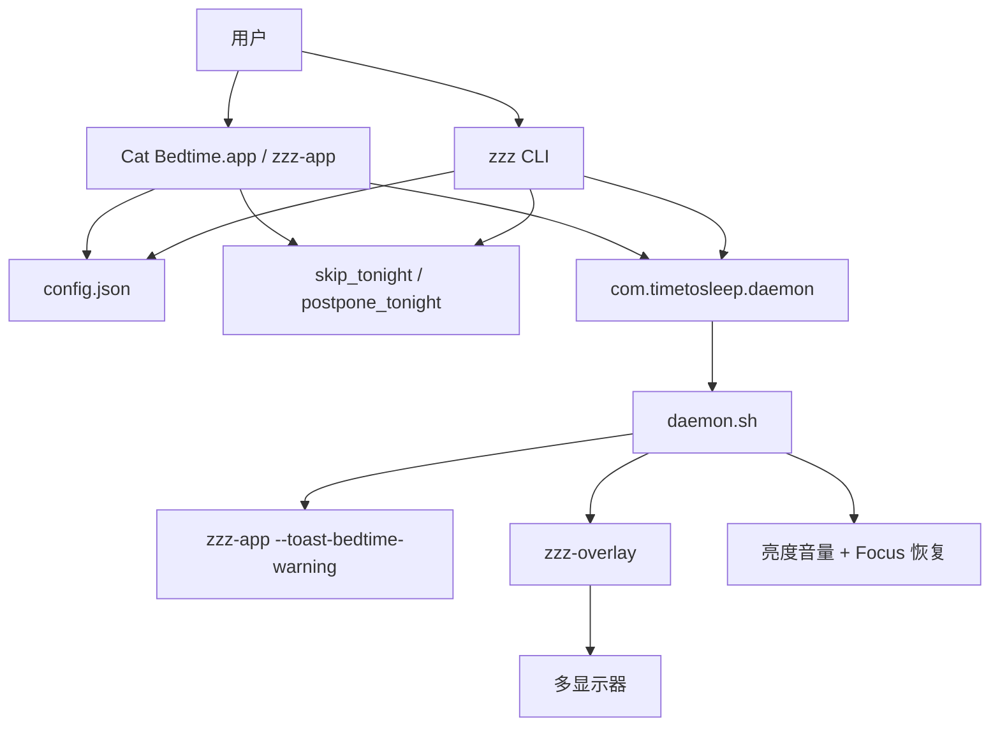

# Cat Bedtime · 猫猫困了 — 架构

本文档描述**当前代码现状**。产品英文名 **Cat Bedtime**，中文名 **猫猫困了**；运行时目录和 launchd label 仍保留 `timetosleep`，用于兼容已有安装。

详细需求见 [`docs/product-specs/`](docs/product-specs/index.md)，技术细节见 [`docs/tech-docs/`](docs/tech-docs/index.md)，踩坑见 [`docs/RELIABILITY.md`](docs/RELIABILITY.md)。

## 目录结构

```text
cat-bedtime/
├── bin/
│   ├── zzz                 # CLI 入口
│   ├── zzz-overlay         # 预编译 Swift 全屏覆盖层（universal binary）
│   └── Cat Bedtime.app     # 构建产物（可执行文件 zzz-app）
├── lib/
│   ├── config.sh           # 配置读写、时间工具、锁屏窗口校验
│   ├── schedule.sh         # launchd 安装 / 更新 / 卸载、catch-up
│   ├── stats.sh            # 到访记录
│   ├── ui.sh               # 终端 UI
│   ├── i18n.sh / i18n.py   # 多语言 msg 解析
├── src/
│   ├── cli/
│   │   ├── init.sh         # zzz init
│   │   ├── daemon.sh       # 睡前提醒 → 锁屏 → 唤醒恢复
│   │   ├── media.sh
│   │   └── brightness.sh
│   ├── app/
│   │   ├── CatBedtimeApp.swift
│   │   ├── build.sh        # 打包 App bundle + Resources
│   │   └── ...
│   ├── shared/L10n.swift   # App 侧 i18n
│   └── overlay/
│       ├── LockScreen.swift      # 正式锁屏
│       ├── build.sh
│       ├── CatBedtimePreview.swift       # 开发预览（不参与正式安装）
│       └── CatVideoBedtimePreview.swift
├── locales/messages.json
├── scripts/generate-messages.py
├── tests/test-*.sh
├── docs/                   # 见 .rule.md
├── install.sh
└── README.md / README_EN.md
```

## 运行时数据

`~/.timetosleep/`：

```text
~/.timetosleep/
├── bin/zzz, bin/zzz-overlay          # CLI 安装复制
├── lib/, src/cli/, assets/
├── config.json
├── stats.json
├── onboarding_install_id             # App：当前安装是否完成 onboarding
├── skip_tonight                      # 今晚请假
├── postpone_tonight                  # 今晚晚点（有效 bedtime + 原因）
├── saved_brightness, saved_volume
└── daemon.log                        # launchd 标准输出/错误
```

## 两种安装方式

| 方式 | 产物 | 入口 | 资源 |
| --- | --- | --- | --- |
| App | `dist/Cat-Bedtime-macOS.dmg` | `Cat Bedtime.app` | `Contents/Resources/`：`bin/zzz-overlay`、`src/cli/`、`lib/`、`assets/`、`locales/` |
| CLI | `dist/cat-bedtime-cli-macos.tar.gz` | `zzz` | 复制到 `~/.timetosleep/` |

App 可执行文件为 **`Contents/MacOS/zzz-app`**。daemon 通过该二进制调用 `--toast-bedtime-warning` 等参数。

两者共享 `~/.timetosleep/`。同时安装时，**最后一次**写入配置 / 注册 launchd 的版本生效。

## 全局流程



## 核心约束

- 正式锁屏唯一实现：`src/cli/daemon.sh` + `src/overlay/LockScreen.swift`。
- daemon 是提醒与锁屏的**唯一执行者**；App 不做每周预排程。
- 锁屏窗口（bedtime → wakeup）须 **0 < 时长 < 15h**（`MAX_LOCK_MINUTES=900`）。
- 睡前提醒：**T-5min / T-1min 强制 App Toast**（`notify.bedtime.*`），不依赖 Notification Center。
- T-1 Toast 可**一次性推迟 5 分钟**（写 `postpone_tonight`，App 进程 exit 2）。

### winddown 的两层含义（易混）

| 概念 | 来源 | 作用 |
| --- | --- | --- |
| `config.winddown_minutes` | 配置（默认 5；CLI 可改 5–120） | launchd **何时启动** daemon（`bedtime - winddown`） |
| `wind_down()` 内 `total_min=5` | daemon 硬编码 | **Toast 与渐变** 仍按睡前 5 分钟编排（T-5 / T-1） |

App Dashboard **不提供** winddown 编辑；仅 CLI `zzz config winddown N` 可改。旧配置 `winddown_minutes=15` 会在 App 启动时迁移为 5。

## 每晚流程

1. launchd 在 wind-down 起点触发 daemon（`RunAtLoad=true`，若已在 wind-down/锁屏窗内会 catch-up 立即跑）。
2. 读配置、`effective_bedtime`（含 `postpone_tonight`）；校验锁屏窗；处理 `skip_tonight`。
3. **wind_down**：T-5 Toast → 亮度/音量渐变 → T-1 Toast（可推迟 5min 一次）→ 到 bedtime。
4. **lockdown**：暂停媒体、静音、最低亮度、尝试 `shortcuts run "Turn On Focus"`、启动 overlay 循环（被杀则 2s 重启）。
5. **wake_up**：恢复亮度音量、`Turn Off Focus`、记录 `completed`（无起床弹窗）。

非启用日的 wind-down：仍可发 T-5 提醒，但 **跳过 lockdown**（`wind_down` 返回 2）。

## App 命令行参数

```text
zzz-app --toast-bedtime-warning <minutes> [--allow-postpone]
zzz-app --toast-locksoon                    # 等价 T-1min，不可推迟
zzz-app --notify / --notify-l10n ...        # 保留；daemon 睡前流程不调用
```

无 App 时 daemon 用 AppleScript `display alert` 兜底（12s 自动关闭）。

## overlay 预览（onboarding）

`LockPreviewView` 启动：

```text
zzz-overlay --preview-exit-on-esc --preview-duration 18
```

预览可 ESC 退出或 18s 超时；不写 `stats.json` completed。

## launchd

| 项 | 值 |
| --- | --- |
| Label | `com.timetosleep.daemon` |
| Plist | `~/Library/LaunchAgents/com.timetosleep.daemon.plist` |
| 触发 | 每天 `bedtime - winddown_minutes` |
| RunAtLoad | `true`（配合 `_should_kickstart_now` catch-up） |
| 日志 | `~/.timetosleep/daemon.log` |

卸载时会清理遗留的 `com.timetosleep.bootcheck`。

## 测试

```bash
for t in tests/test-*.sh; do bash "$t"; done
```

| 脚本 | 覆盖 |
| --- | --- |
| `test-lockdown-window-and-syntax.sh` | daemon 语法、跨午夜 |
| `test-overslept-detection.sh` | 休眠后不误锁 |
| `test-locksoon-toast.sh` | T-5/T-1 Toast、无 NC 睡前提醒 |
| `test-lock-duration-limit.sh` | 锁屏窗 `< 15h` |
| `test-daemon-startup-phase.sh` | winddown / lockdown 阶段 |
| `test-schedule-catchup.sh` | RunAtLoad catch-up |
| `test-config-numeric-fallback.sh` | 无 jq 读数字配置 |
| `test-i18n-lang.sh` | 多语言 |

## 改代码入口

| 目标 | 路径 |
| --- | --- |
| CLI | `bin/zzz` |
| 领养 | `src/cli/init.sh` |
| 提醒 / 锁屏 | `src/cli/daemon.sh` |
| launchd | `lib/schedule.sh` |
| 配置 / 锁窗 | `lib/config.sh` |
| App UI / Toast | `src/app/CatBedtimeApp.swift` |
| 锁屏 UI | `src/overlay/LockScreen.swift` |
| 文案 | `locales/messages.json` |
